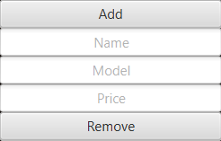

# Car Rental Application

## The program starts with 2 cars already loaded

## The Add and remove buttons

### Add Works by typing the data and pressing the button to add to the table te given data.
### Remove works by selecting an item from the table and pressing the remove button. The selected item will be removed.

## The Checks
### The buttons show instructions when you hover them but for ease:

### They will show to the left of each button the data coresponding to the functionality chosen.

## Load/Save
### The program can load and save in 2 types of files, text and binary.

### Each option when selected will load/save to the prompted type of file. 
#### File will load/save to a text file Input.txt / Output.txt.
#### Binary will load/save to a binary file InputBinary / OutputBinary.

## Reservations
### To reserve a car type your name and the date you want to reserve the car, select the car you want to reserve and then press reserve.

### To cancel a reservation select a reserved car and press the Cancel Reservation button.
### The Show reservation button displays below the reservation date of a selected car.

## Prints

### Print All - Prints everything
### Print Rented - Prints rented cars
### Print Available - Prints cars that are not rented
